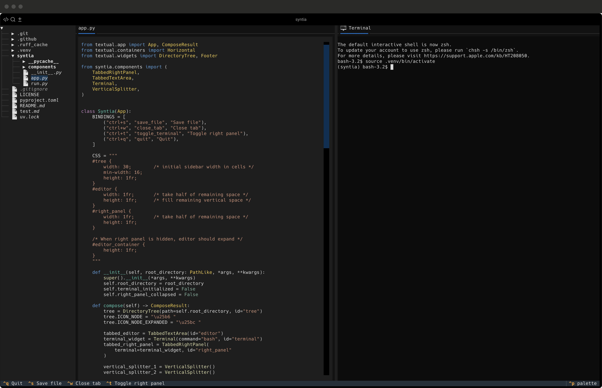

# Syntia-Term


[](https://pypi.org/project/syntia/)

Syntia-Term brings modern IDE features to your terminal. Built with [Textual](https://textual.textualize.io/), Syntia-Term combines the power of a traditional code editor with the convenience of an integrated terminal environment.



## ✨ Features

### 🗂️ **Smart File Management**
- **Directory Tree**: Navigate your project structure with an intuitive file browser
- **Tabbed Editor**: Work on multiple files simultaneously with a tabbed interface
- **Syntax Highlighting**: Full syntax support for Python, JavaScript, TypeScript, JSON, Markdown, and more

### 💻 **Integrated Development Environment**
- **Built-in Terminal**: Full-featured terminal integration with bash support
- **Markdown Preview**: Live preview of Markdown files in a dedicated panel
- **Split-Panel Layout**: Resizable panels with vertical splitters for optimal workspace organization
- **Collapsible Panels**: Toggle the right panel to maximize editor space when needed

### ⚡ **Productivity Features**
- **Keyboard Shortcuts**: Fast navigation and file operations
- **Auto-save**: Convenient file saving with notifications
- **Tab Management**: Easy tab switching and closing
- **Multi-language Support**: Intelligent language detection and highlighting

### 🎨 **User Experience**
- **Modern Terminal UI**: Clean, responsive interface that works in any terminal
- **Contextual Notifications**: Real-time feedback for file operations
- **Flexible Layout**: Adaptive interface that scales with your terminal size

## 🚀 Quick Start

### Installation

```bash
pip install -U syntia-term
```

You can also install syntia-term using [Homebrew](https://brew.sh/)

```bash
brew install syntia-term
```

Open your project directory using the `syntia-term` command:

```bash
syntia-term /path/to/project
```

### Keyboard Shortcuts

| Shortcut | Action |
|----------|--------|
| `Ctrl+S` | Save current file |
| `Ctrl+W` | Close current tab |
| `Ctrl+T` | Toggle terminal panel |
| `Ctrl+Q` | Quit application |

### Working with Files

1. **Opening Files**: Click on any file in the directory tree to open it in a new tab
2. **Editing**: Click in the editor area and start typing
3. **Saving**: Use `Ctrl+S` or the save command
4. **Switching Tabs**: Click on tab headers to switch between open files
5. **Markdown Preview**: Markdown files automatically open a preview in the right panel

### Terminal Integration

- The integrated terminal starts with bash by default
- Use `Ctrl+T` to show/hide the terminal panel
- Terminal commands work exactly as in your system terminal
- All terminal features including colors and interactive programs are supported


## 🙏 Acknowledgments

- Built with [Textual](https://textual.textualize.io/) - An amazing Python TUI framework
- Terminal emulation based on [textual-terminal](https://github.com/mitosch/textual-terminal)
- Inspired by modern code editors like VS Code and Sublime Text
- Built by using the [this](https://fronkan.hashnode.dev/writing-a-text-editor-in-7-minutes-using-textual) amazing tutorial by [Fredrik Sjöstrand](https://hashnode.com/@fronkan) as a starting point.
